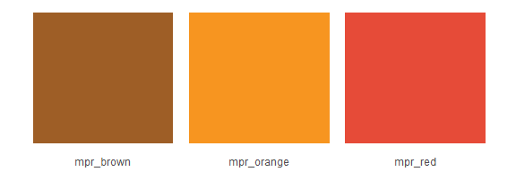

Guide to using theme\_mpr()
================
David H. Montgomery
December 29, 2017

Hadley Wickham's `ggplot` package is a powerful and flexible way to make graphics ([learn the basics here](https://github.com/dhmontgomery/r-data-for-beginners/blob/master/r_for_beginners.md)), but its standard output doesn't conform to MPR News' house style for graphics. All that power and flexibility doesn't mean much if graphics require extensive customization in Illustrator before they can be used.

Fortunately, `ggplot` supports custom themes that can radically change the appearance of its graphs. I wrote one such theme, `theme_mpr`, designed to apply MPR News' graphics style to `ggplot` graphs. This is a guide for how to apply that style.

(The actual theme belongs to MPR and is not shared here; the following guide was produced for MPR News and is shared here with permission as an example of my work there.)

Beginning
---------

Let's say we want to make a simple graph of a basic dataset, approval ratings for four politicians in a KSTP poll:

``` r
# Create the data
kstp <- data.frame(
    "candidate" = c("Sen. Al Franken","Sen. Amy Klobuchar","Gov. Mark Dayton","Pres. Donald Trump"), 
    "approval" = c(0.36,0.56,0.42,0.31), 
    "party" = c("Democrat", "Democrat", "Democrat", "Republican")) %>%
    mutate(candidate = candidate %>% as.factor() %>% fct_relevel("Pres. Donald Trump", "Sen. Al Franken", "Gov. Mark Dayton", "Sen. Amy Klobuchar")) # Reorder the politicians
kstp
```

    ##            candidate approval      party
    ## 1    Sen. Al Franken     0.36   Democrat
    ## 2 Sen. Amy Klobuchar     0.56   Democrat
    ## 3   Gov. Mark Dayton     0.42   Democrat
    ## 4 Pres. Donald Trump     0.31 Republican

Here's how we'd make that graph in basic `ggplot`:

``` r
library(tidyverse) # Load necessary libraries
library(scales)
library(forcats)
# Create the plot from the data source `kstp` with candidates on the X-axis and approval rating on the Y-axis
ggplot(kstp, aes(candidate, approval)) +
    geom_col() + # Make it a column graph
    scale_y_continuous(labels = percent) + # Format the Y-axis labels as percents
    # Add labels
    geom_text(aes(label = paste0(round(approval * 100), "%")), # Define labels as approval * 100, with a % sign
        vjust = 1.3, color = "white") +  # Move the labels down vertically, color them white
    # Add labels
    labs(title = "Minnesotans' approval of politicians in KSTP survey", # Title
         subtitle = "Source: KSTP-TV/SurveyUSA. Survey conducted Nov. 20, 2017.", # Subtitle
         caption = "Graphic by David H. Montgomery", # Caption
         x = "", y = "Percent of Minnesotans") # Axis titles, with the X-axis title blank
```


That's a perfectly fine graphic, but it doesn't match MPR's style.

Adding theme\_mpr
-----------------

You can get most of the way to MPR's style by just adding a single line of code to what we had above.

Well, two lines of code, since first we have to load the theme from our disk. Use the `source()` function and point it to where `theme_mpr.R` is saved on your computer. In my case, it's in the folder `graphics`:

``` r
source("graphics/theme_mpr.R")
```

Once you've done that, then the function `theme_mpr()` has been added to your R session (along with a few other things we'll get to in a bit).

So now let's run that same code as above, but add a line calling `theme_mpr()`:

``` r
ggplot(kstp, aes(candidate, approval)) +
    geom_col() +
    scale_y_continuous(labels = percent) +
    geom_text(aes(label = paste0(round(approval * 100), "%")), vjust = 1.3, color = "white") + 
    labs(title = "Minnesotans' approval of politicians in KSTP survey",
         subtitle = "Source: KSTP-TV/SurveyUSA. Survey conducted Nov. 20, 2017.",
         caption = "Graphic by David H. Montgomery",
         x = "", y = "Percent of Minnesotans") +
    theme_mpr() # Add theme_mpr
```


Adding that one line, `theme_mpr()`, changed a whole host of things:

-   Fonts
-   Font size
-   Font color
-   Bar color
-   Plot background
-   Gridlines
-   Label justification
-   Outlined the graphic

Further tweaks
--------------

There are a few parts of MPR News' style that `theme_mpr()` can't change. Principally, this involves anything that reflects data and not just appearance. Even though MPR News' style calls for axis labels to be capitalized, `theme_mpr()` can't do that for us. Let's do that now. (We'll also move the Source line down to the caption.)

``` r
kstp$candidate <- toupper(kstp$candidate) # Modify the original data to put candidate names in all caps
ggplot(kstp, aes(candidate, approval)) +
    geom_col() +
    scale_y_continuous(labels = percent) +
    geom_text(aes(label = paste0(round(approval * 100), "%")), vjust = 1.3, color = "white") + 
    labs(title = "Minnesotans' approval of politicians in KSTP survey",
         subtitle = "Survey conducted Nov. 20, 2017",
         caption = "SOURCE: KSTP-TV/SURVEYUSA        GRAPHIC BY DAVID H. MONTGOMERY",
         x = "", y = "PERCENT OF MINNESOTANS") +
    theme_mpr() # Add theme_mpr
```


Don't worry about the title running off the end of the page for now.

Just as we have to manually change text content, while `theme_mpr()` can set a new default color for bars, bar color is treated as data by `ggplot`, so if we want to do any fine-tuning to bar color, we have to do it manually.

Here we'll color the bars based on the party of the politician. We'll do so by calling another function contained in `theme_mpr.R`. In `ggplot`, the `scale_fill_` functions define color schemes when we're assigning color or fill according to a variable. I've added a custom function, `scale_fill_bluered`, which colors a graph with a blue-red color scheme ideal for Democrats and Republicans. (There's also a `scale_fill_redblue`, which just reverses the order of the colors; use it if you're getting red Democrats and blue Republicans.)

Here, I've changed four things:

-   Added `fill = party` to `aes()` at the top, to tell `ggplot` to determine fill color by the party variable
-   Added `scale_fill_bluered()`
-   Updated the `labs()` to include a label for the legend
-   I put "Democrat" and "Republican" from the original data frame into all caps by running `kstp$party <- toupper(kstp$party)`.

``` r
kstp$party <- toupper(kstp$party)
ggplot(kstp, aes(candidate, approval, fill = party)) +
    geom_col() +
    scale_y_continuous(labels = percent) +
    geom_text(aes(label = paste0(round(approval * 100), "%")), vjust = 1.3, color = "white") + 
    labs(title = "Minnesotans' approval of politicians in KSTP survey",
         subtitle = "Survey conducted Nov. 20, 2017",
         caption = "SOURCE: KSTP-TV/SURVEYUSA        GRAPHIC BY DAVID H. MONTGOMERY",
         x = "", y = "PERCENT OF MINNESOTANS",
         fill = "PARTY AFFILIATION: ") +
    theme_mpr() + # Add theme_mpr
    scale_fill_bluered()
```


Adding the logo
---------------

The final piece of the puzzle is to add MPR's logo to the chart. (This will also conveniently fix the issue with the headline running off screen.)

To do that, we only need to add a single extra line of code, thanks to another function included in `theme_mpr.R`: `addlogo()`.

``` r
p <- ggplot(kstp, aes(candidate, approval, fill = party)) +
    geom_col() +
    scale_y_continuous(labels = percent) +
    geom_text(aes(label = paste0(round(approval * 100), "%")), vjust = 1.3, color = "white") + 
    labs(title = "Minnesotans' approval of politicians in KSTP survey",
         subtitle = "Survey conducted Nov. 20, 2017",
         caption = "SOURCE: KSTP-TV/SURVEYUSA        GRAPHIC BY DAVID H. MONTGOMERY",
         x = "", y = "PERCENT OF MINNESOTANS",
         fill = "PARTY AFFILIATION: ") +
    theme_mpr() + # Add theme_mpr
    scale_fill_bluered()
addlogo(p)
```


(We also changed the code slightly, storing the original graph as an object `p` and then calling that object as the variable for `addlogo()`. This is necessary.)

Sometimes you'll make a graph that just doesn't fit in the standard rectangular 16:9 ratio. `theme_mpr` can handle that! Instead of `addlogo(p)`, you'll want to run `addlogo(p, square = TRUE)`.

Other elements
--------------

The `theme_mpr.R` file also has a few other useful features that can help you customize graphs made with `ggplot` to fit MPR News' style.

-   One thing `theme_mpr()` does is change R's default color to an MPR blue. This will stay until you restart R or RStudio -- or until you call the function `theme_reset()` contained in `theme_mpr.R`. That turns the default color (and font) back to basic `ggplot`.
-   The file also contains several color palettes you can call: `mpr_blues` and `mpr_greys`. Each is a list of five colors that you can add to your graphs by indicating which element of the list you want. For example, `color = mpr_blues[2]` will set the color to the second color in `mpr_blues`.


-   There are also three specific colors that you can call by name: `mpr_red`, `mpr_orange` and `mpr_brown`


